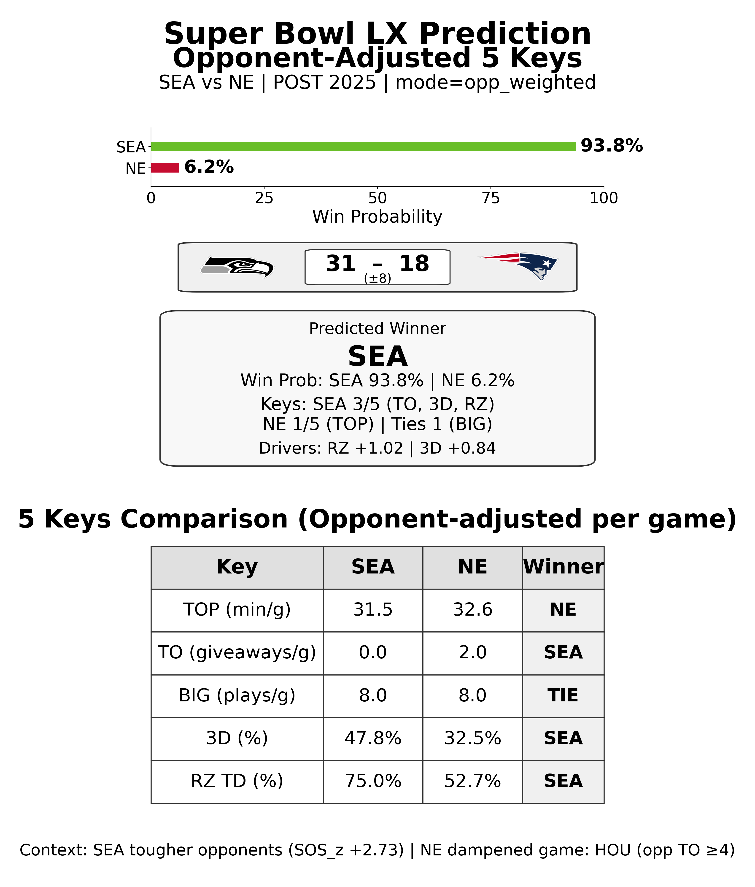

# SuperBowlEngine – Super Bowl LX Prediction & QB Production Model

I built SuperBowlEngine to predict Super Bowl outcomes and quarterback impact using a multi-engine pipeline inspired by front-office decision support. It combines team-level keys, opponent-adjusted weighting, and a separate QB production engine into win probabilities, score projections, and scouting-style visuals.

**If you came here from LinkedIn,** this project is also summarized under my Projects section there.

---

## How the Model Works

### Team Outcome Engine (5 Keys)

The team engine is built on five keys: **Time of Possession**, **Turnovers**, **Big Plays**, **3rd Down Efficiency**, and **Red Zone TD%**. The predictive framework uses a “3-of-5 keys” rule: winning at least three of these five is a strong historical predictor of who wins the game. The model compares both teams on each key and combines the margins into a single win probability.

Playoff performance is **opponent-adjusted** using regular-season defensive strength (SOS and defensive difficulty), so beating a tough defense is weighted more than beating a weak one. Keys can be aggregated with **postseason vs regular-season context**—e.g., opponent-weighted postseason averages with optional dampening for opponent turnover meltdowns—so the evaluation reflects who you played and when.

### Quarterback Production Engine

The QB engine does **not** use box-score totals. It scores postseason quarterback impact on three dimensions: **drive sustainability** (converting and avoiding negative plays), **high-leverage execution** (third down and red zone), and **off-script value** (scrambles and extended plays). Each component is **adjusted for defensive difficulty** using regular-season EPA allowed (or a success-based fallback), so performance against elite defenses is weighted appropriately.

**The team-level model explains why the game tilts one way; the QB production engine explains how that advantage is created on the field.**

---

## Example Scouting Report Output



This is the Team Outcome Engine scouting report for Super Bowl LX. It compares both teams across the five keys and shows key winners, margins, and contextual drivers (e.g., opponent difficulty and top contributors). The format is designed for clarity and slide-ready presentation, not dense charts.

---

## Outputs

- **Win probabilities** (e.g., SEA vs NE) from the Professor Keys engine.
- **Score prediction** from a regression on key margins (display only; win probability is keys-based).
- **Visual scouting-style reports**: tables and cards (e.g., slide5 prediction, explainer, QB production strip) saved under `outputs/`, not raw charts.

---

## Repository Tour

| Area | Purpose |
|------|---------|
| `src/superbowlengine/models/` | Team outcome engine: `predict`, `predict_from_keys`, score model, turnover regression. |
| `src/superbowlengine/data/` | nflreadpy-based PBP and schedule loading; availability checks. |
| `src/superbowlengine/features/` | Per-game keys, opponent weighting, SOS, keys pipeline. |
| `src/superbowlengine/viz/` | Slide5 prediction and explainer visuals; QB production card. |
| `scripts/run_and_make_slide5.py` | Full pipeline: load data, compute keys, predict, render slide 5 + JSON. |
| `scripts/make_qb_prod_card.py` | QB production strip and JSON reports for two QBs. |
| `scripts/list_team_games.py` | List team games (postseason) for a given year. |
| `scripts/inspect_nflreadpy_columns.py` | Inspect nflreadpy PBP columns for a season. |

---

## Quickstart

From the project root (with the package installed):

```bash
pip install -e .
```

**Generate Slide 5 (prediction + explainer + JSON)** for 2025, SEA vs NE, opponent-weighted keys:

```bash
python scripts/run_and_make_slide5.py --year 2025 --team-a SEA --team-b NE --mode opp_weighted
```

With debug output (key winners, margins, contributions, per-game table):

```bash
python scripts/run_and_make_slide5.py --year 2025 --team-a SEA --team-b NE --mode opp_weighted --debug
```

**Generate QB production card** for 2025 (example: Drake Maye vs Sam Darnold):

```bash
python scripts/make_qb_prod_card.py --year 2025 --qb-a "Drake Maye" --team-a NE --qb-b "Sam Darnold" --team-b SEA
```

Data is loaded via **nflreadpy** (nflverse). Optional filesystem cache:

```bash
export NFLREADPY_CACHE=filesystem
export NFLREADPY_CACHE_DIR=~/.cache/nflreadpy
```

Requirements: Python 3.9+, nflreadpy, pandas. Optional: streamlit, matplotlib, pytest.

---

## Methodology Notes

- **Tie handling:** When a key is tied, it is explicitly labeled as TIE; neither team is forced a winner on that key.
- **Big plays:** Pass ≥ 15 yards, rush ≥ 10 yards (configurable in `config.py`).
- **Opponent meltdown dampener:** In `opp_weighted` mode, games where the opponent’s turnovers exceed a threshold are down-weighted so outlier giveaways don’t dominate the average.
- **Availability:** The data layer reports readiness (GREEN / YELLOW / RED) based on required PBP columns for the 5 Keys pipeline.

---

## Future Work

- Improve score prediction calibration and uncertainty intervals.
- Richer visuals: larger fonts, table layouts, no overlapping text.
- Team rankings / percentiles in the explainer and slide assets.
- Expanded scouting report export (e.g., PDF/PNG bundle).
- Generalized matchup runner for any teams and years.
- Model validation across past Super Bowls (backtesting).
- Optional Streamlit/CLI for ad-hoc matchups without editing scripts.

---

I’m continuing to refine SuperBowlEngine as a reusable system for matchup-level prediction and QB impact, and to align it with how front offices separate signal from noise. The codebase is structured so new seasons and matchups can be run with minimal changes.
